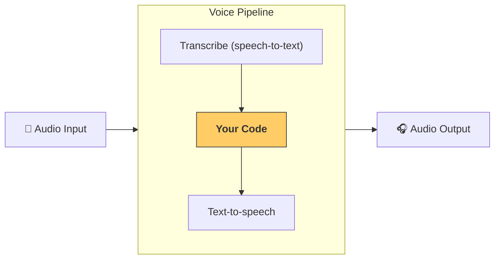

---
search:
  exclude: true
---
# パイプラインとワークフロー

[`VoicePipeline`][agents.voice.pipeline.VoicePipeline] は、エージェント的なワークフローを音声アプリに簡単に変換できるクラスです。実行するワークフローを渡すと、パイプラインが入力音声の文字起こし、音声の終了検出、適切なタイミングでのワークフロー呼び出し、そしてワークフロー出力の音声化までを処理します。



## パイプラインの設定

パイプラインを作成する際、次の項目を設定できます。

1. 毎回新しい音声が文字起こしされるたびに実行されるコードである [`workflow`][agents.voice.workflow.VoiceWorkflowBase]
2. 使用する [`speech-to-text`][agents.voice.model.STTModel] と [`text-to-speech`][agents.voice.model.TTSModel] のモデル
3. 次のような項目を設定できる [`config`][agents.voice.pipeline_config.VoicePipelineConfig]
    - モデルプロバイダー。モデル名をモデルにマッピングできます
    - トレーシング。トレーシングの有効・無効、音声ファイルのアップロード有無、ワークフロー名、トレース ID など
    - TTS と STT モデルの設定。プロンプト、言語、使用するデータ型など

## パイプラインの実行

パイプラインは [`run()`][agents.voice.pipeline.VoicePipeline.run] メソッドで実行でき、音声入力を次のいずれかの形式で渡せます。

1. [`AudioInput`][agents.voice.input.AudioInput] は、完全な音声の書き起こしを持ち、その結果のみを生成したい場合に使います。話者の発話終了検出が不要なケース、例えば事前収録音声や、ユーザーの発話終了が明確なプッシュ・トゥ・トークのアプリで有用です。
2. [`StreamedAudioInput`][agents.voice.input.StreamedAudioInput] は、ユーザーの発話終了検出が必要な場合に使います。検出された音声チャンクを逐次プッシュでき、ボイスパイプラインが「アクティビティ検出」により適切なタイミングでエージェントのワークフローを自動実行します。

## 結果

ボイスパイプライン実行の結果は [`StreamedAudioResult`][agents.voice.result.StreamedAudioResult] です。これは、発生したイベントをストリーミングできるオブジェクトです。いくつかの種類の [`VoiceStreamEvent`][agents.voice.events.VoiceStreamEvent] があり、次のものを含みます。

1. 音声チャンクを含む [`VoiceStreamEventAudio`][agents.voice.events.VoiceStreamEventAudio]
2. ターンの開始や終了などライフサイクルイベントを通知する [`VoiceStreamEventLifecycle`][agents.voice.events.VoiceStreamEventLifecycle]
3. エラーイベントである [`VoiceStreamEventError`][agents.voice.events.VoiceStreamEventError]

```python

result = await pipeline.run(input)

async for event in result.stream():
    if event.type == "voice_stream_event_audio":
        # play audio
    elif event.type == "voice_stream_event_lifecycle":
        # lifecycle
    elif event.type == "voice_stream_event_error"
        # error
    ...
```

## ベストプラクティス

### 割り込み

Agents SDK は現在、[`StreamedAudioInput`][agents.voice.input.StreamedAudioInput] に対する組み込みの割り込みサポートを提供していません。代わりに、検出された各ターンごとにワークフローの個別の実行がトリガーされます。アプリケーション内で割り込みを扱いたい場合は、[`VoiceStreamEventLifecycle`][agents.voice.events.VoiceStreamEventLifecycle] イベントをリッスンできます。`turn_started` は新しいターンが文字起こしされ処理が開始されたことを示します。`turn_ended` は該当ターンの音声がすべてディスパッチされた後にトリガーされます。これらのイベントを用いて、モデルがターンを開始したときに話者のマイクをミュートし、ターンに関連する音声をすべてフラッシュした後にアンミュートする、といった制御が可能です。