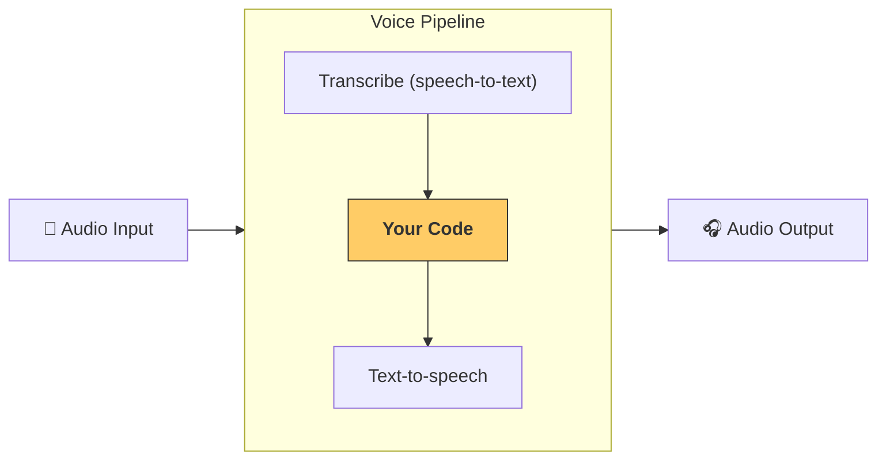

---
search:
  exclude: true
---
# パイプラインとワークフロー

[`VoicePipeline`][agents.voice.pipeline.VoicePipeline] は、エージェント ワークフローを音声アプリに簡単に変換できるクラスです。実行するワークフローを渡すと、パイプラインが入力音声の文字起こし、音声の終了検知、適切なタイミングでのワークフロー呼び出し、そしてワークフロー出力を音声に戻す処理までを行います。


```mermaid
graph LR
    %% Input
    A["🎤 Audio Input"]

    %% Voice Pipeline
    subgraph Voice_Pipeline [Voice Pipeline]
        direction TB
        B["Transcribe (speech-to-text)"]
        C["Your Code"]:::highlight
        D["Text-to-speech"]
        B --> C --> D
    end

    %% Output
    E["🎧 Audio Output"]

    %% Flow
    A --> Voice_Pipeline
    Voice_Pipeline --> E

    %% Custom styling
    classDef highlight fill:#ffcc66,stroke:#333,stroke-width:1px,font-weight:700;

```

## パイプラインの設定

パイプラインを作成する際に、次の項目を設定できます。

1. [`workflow`][agents.voice.workflow.VoiceWorkflowBase]: 新しい音声が文字起こしされるたびに実行されるコード
2. 使用する [`speech-to-text`][agents.voice.model.STTModel] および [`text-to-speech`][agents.voice.model.TTSModel] のモデル
3. [`config`][agents.voice.pipeline_config.VoicePipelineConfig]: 次のような項目を設定できます
    - モデル プロバイダー（モデル名をモデルにマッピングできます）
    - トレーシング（トレーシングの無効化、音声ファイルのアップロード可否、ワークフロー名、トレース ID など）
    - TTS および STT モデルの設定（プロンプト、言語、使用するデータ型 など）

## パイプラインの実行

パイプラインは [`run()`][agents.voice.pipeline.VoicePipeline.run] メソッドで実行できます。音声入力は次の 2 つの形式で渡せます。

1. [`AudioInput`][agents.voice.input.AudioInput]: 音声全体の文字起こしがあり、その結果だけを生成したい場合に使用します。発話の終了検知が不要なケース、たとえば録音済み音声や、ユーザーの発話終了が明確なプッシュ・トゥ・トーク アプリで有用です。
2. [`StreamedAudioInput`][agents.voice.input.StreamedAudioInput]: ユーザーの発話終了を検知する必要がある場合に使用します。検出された音声チャンクを順次プッシュでき、音声パイプラインは「activity detection」と呼ばれるプロセスを通じて、適切なタイミングで自動的にエージェント ワークフローを実行します。

## 結果

音声パイプラインの実行結果は [`StreamedAudioResult`][agents.voice.result.StreamedAudioResult] です。これは、発生するイベントをストリーミングできるオブジェクトです。含まれる [`VoiceStreamEvent`][agents.voice.events.VoiceStreamEvent] には、次の種類があります。

1. [`VoiceStreamEventAudio`][agents.voice.events.VoiceStreamEventAudio]: 音声チャンクを含みます。
2. [`VoiceStreamEventLifecycle`][agents.voice.events.VoiceStreamEventLifecycle]: ターンの開始・終了などのライフサイクル イベントを通知します。
3. [`VoiceStreamEventError`][agents.voice.events.VoiceStreamEventError]: エラー イベントです。

```python

result = await pipeline.run(input)

async for event in result.stream():
    if event.type == "voice_stream_event_audio":
        # play audio
    elif event.type == "voice_stream_event_lifecycle":
        # lifecycle
    elif event.type == "voice_stream_event_error"
        # error
    ...
```

## ベストプラクティス

### 割り込み

Agents SDK は現在、[`StreamedAudioInput`][agents.voice.input.StreamedAudioInput] に対する組み込みの割り込みサポートを提供していません。代わりに、検出された各ターンごとに、ワークフローの個別の実行がトリガーされます。アプリケーション内で割り込みを扱いたい場合は、[`VoiceStreamEventLifecycle`][agents.voice.events.VoiceStreamEventLifecycle] イベントを監視してください。`turn_started` は、新しいターンが文字起こしされ処理が開始されたことを示します。`turn_ended` は、該当ターンのすべての音声がディスパッチされた後にトリガーされます。モデルがターンを開始したときに話者のマイクをミュートし、ターンに関連する音声をすべてフラッシュした後にミュート解除する、といった制御にこれらのイベントを活用できます。
